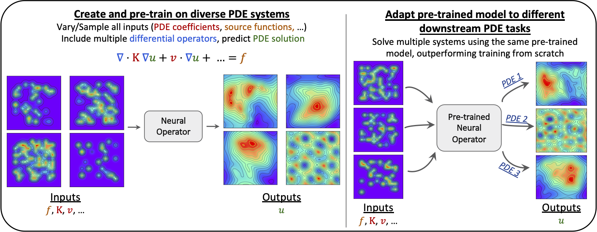

# Characterizing Scaling and Transfer Learning of Neural Networks in SciML
This repository contains PyTorch code for training the Fourier Neural Operator on different PDE systems to characterize its scaling and transfer learning behavior on different downstream tasks. 


## Environment
The necessary packages for this code can be installed via
```
pip install -r requirements.txt
```

## Data Generation
We consider three PDE systems: Poisson's, Advection-Diffusion, Helmholtz. For the data generation, we sample source functions and PDE coefficients to create train-val-test data splits. The layout for data generation is:

- `utils/gen_data_[pde].py` generates the data for the PDE system [pde] for the three PDEs. 
- `run_gen_data.sh` is an example run script to generate data. See the comments in the script for different hyperparameters that control the data generation process. The ``--help`` option can also be used on the python scripts for more information. The paths to data and PDE coefficient ranges need to be set here.
- Once the data is generated, the scales for input normalization can be generated using ``utils/get_scale.ipynb``. The data paths and scales paths are passed to the configuration files for training.

## Training and Inference
- Configuration files (in YAML format) are in `configs/` for different PDE systems. For example, config for Poisson's is in `configs/operator_poisson.yaml`.  The main configs for the three systems are ``poisson-scale-k1_5``, ``ad-scale_adr0p2_1`` and ``helm-scale-o1_10``. The data paths and scales paths need to be set here.
- Data, trainer, and other miscellaneous utilities are in `utils/`. We use standard PyTorch dataloaders and models wrapped with DDP for distributed data-parallel training with checkpointing.
- The FNO model is the standard model and is in`models/`. The hyperparameters used are in the config files for the respective PDE systems.
- Environment variables for DDP (local rank, master port etc) are set in `export_DDP_vars.sh` to be sourced before running any distributed training. See the [PyTorch DDP tutorial](https://pytorch.org/tutorials/intermediate/ddp_tutorial.html) for more details on using DDP. There are other ways to implement this, but our run script is specifically for slurm systems.
- Example running scripts are in `run.sh` (4 GPU DDP train script). ``train.py`` is the training script (``utils/trainer.py``) is the trainer class and ``eval.py`` can be used for inference (``utils/inferencer.py`` is the inference class). See the run scripts for details.

### HPO tuning and scaling with W&B
We use [Weights & Biases](https://wandb.ai/site) (see their docs for details) for logging and tuning of all experiments. The ``log_to_wandb`` flag in the configuration files can be set to ``True`` for this once you have a W&B login and project setup.  For model scaling and data scaling, we use their [HPO sweep feature](https://docs.wandb.ai/guides/sweeps). An example sweep config that sweeps over different downstream dataset sizes and learning rates is in ``config/sweep_config.yaml``.  We use the ``subsample`` hyperparameter to sub-sample our downstream dataset for the dataset scaling. For example, ``subsample=2`` implies only half of the data is used for training, etc.
